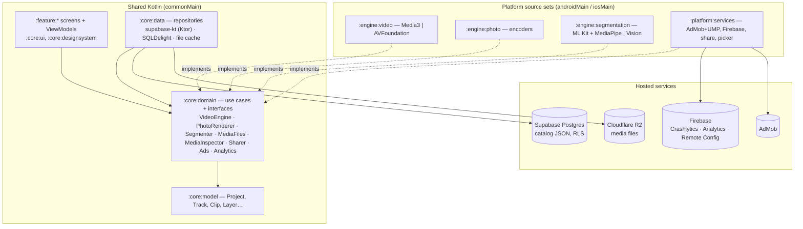

# Technical design

This file is the source of truth (owner, 8 Oct 2026). The "Memix — Product Requirements" Claude Doc (https://claude.ai/code/artifact/c81028c0-e543-4488-ace3-100bdcbb9e10) is the original plan, kept for reference only; changes aren't synced back to it.

## Architecture at a glance

Shared Kotlin code holds the UI, the domain and the data layer; only the video engine, background removal and platform services are written per platform.



Features and data never talk to each other directly: both go through domain interfaces, which also lets iOS swap in its own engines without touching shared code.

## Modules and layers

The code is one Gradle multi-module Kotlin Multiplatform project using clean architecture: presentation and data both depend on domain, and platform engines sit behind interfaces defined in domain.

| Module | Layer | Holds | Depends on |
| --- | --- | --- | --- |
| `:androidApp` | App | Android `Application`, `MainActivity`, manifest (AGP 9 keeps the Android app out of KMP modules) | `:composeApp` |
| `:composeApp` | App | Shared root: `App()`, navigation host, Koin graph, iOS entry point (`MainViewController`); builds the `ComposeApp` framework that `iosApp/` (Xcode) embeds | All feature modules |
| `:core:model` | Domain | Project, Track, Clip, Layer, Effect, Sound and Template entities; serialization | Nothing |
| `:core:domain` | Domain | Use cases; repository interfaces; engine interfaces (`VideoEngine`, `PhotoRenderer`, `Segmenter`, `MediaFiles`, `MediaInspector`, `Sharer`, `Ads`, `Analytics`) | `:core:model` |
| `:core:data` | Data | Repositories; remote source (supabase-kt on Ktor); local source (SQLDelight); file cache; settings | `:core:domain` |
| `:core:designsystem` | Presentation | Memix tokens, theme, base components | Nothing |
| `:core:ui` | Presentation | Shared composables: timeline, layer handles, sliders, pickers | `:core:designsystem`, `:core:model` |
| `:engine:video` | Platform | `VideoEngine`: Media3 in `androidMain`, AVFoundation in `iosMain` | `:core:domain` |
| `:engine:photo` | Platform | Shared photo renderer plus platform encoders (PNG, JPG, GIF, WebP) | `:core:domain` |
| `:engine:segmentation` | Platform | `Segmenter`: ML Kit and MediaPipe on Android, Vision on iOS | `:core:domain` |
| `:platform:services` | Platform | AdMob and UMP, Firebase, share intents; the gallery picker and storage-screen launchers (Compose hooks for the composition root) and media copies and checks (`MediaFiles`, `MediaInspector`) | `:core:domain` |
| `:feature:onboarding`, `:feature:home`, `:feature:templates`, `:feature:sounds`, `:feature:drafts`, `:feature:video-editor`, `:feature:photo-editor`, `:feature:export` | Presentation | Screens and ViewModels | `:core:domain`, `:core:ui` |

- **Domain stays pure:** `:core:model` and `:core:domain` live in `commonMain` with no Android or iOS imports.
- **Features call use cases only:** never repositories or engines directly.
- **Platform code** lives only in the `androidMain` and `iosMain` source sets of engine and platform modules, plus the composition root (`:androidApp`, `:composeApp`) for app entry and wiring, such as the SQLDelight driver and debug hand-check hooks (owner, 8 Oct 2026).
- **iOS compiles from day one:** CI builds the iOS framework on every push to a phase branch and every pull request, even before iOS work starts, so Android-only APIs never leak into shared code.
- **State:** each ViewModel exposes one `StateFlow<UiState>` and takes `Intent` events (MVVM with one-way data flow). Editors keep an undo stack of immutable project snapshots in a `ProjectEditSession` (see Project data model → Editing, undo and auto-save).

## Project data model

One serializable `Project` describes both editors, so drafts, templates, undo and export all work from the same data. The code lives in `:core:model` (`app.memix.core.model.project`); this is its shape as built in P1-01. Fields for later features (speed, keyframes, filters, masks, transitions, audio effects, layer lock/opacity, meme formats) are added by the ticket that needs them, with a schema bump.

```kotlin
@Serializable
data class Project(
    val id: String,
    val type: ProjectType,                 // VIDEO or PHOTO
    val name: String,
    val canvas: Canvas,                    // ratio chip, widthPx, heightPx, background (Solid color or Blur)
    val video: VideoTimeline? = null,      // set when type == VIDEO
    val photo: PhotoScene? = null,         // set when type == PHOTO
    val createdAtEpochUs: Long,            // wall clock, µs since 1970 UTC
    val updatedAtEpochUs: Long,            // set on every save; the drafts list sorts by it
    val schemaVersion: Int = CURRENT_SCHEMA_VERSION,
)

data class VideoTimeline(val tracks: List<Track>)   // always exactly one MAIN_VIDEO track

data class Track(
    val id: String,
    val kind: TrackKind,              // MAIN_VIDEO, OVERLAY, TEXT, STICKER, MEME_SOUND, AUDIO, EFFECT
    val items: List<TimelineItem>,    // placed by startUs, never by list index
    val muted: Boolean = false,
    val locked: Boolean = false,
)

sealed interface TimelineItem { val id: String; val startUs: Long; val durationUs: Long }
// MediaClip(source: MediaRef, trimInUs, trimOutUs, volume, audioDetached, fit: FIT|FILL)   MAIN_VIDEO, OVERLAY
// AudioClip(source: MediaRef, trimInUs, trimOutUs, volume)                                  MEME_SOUND, AUDIO
// TextItem(durationUs, text, style: CaptionStyle(fontId, color, outlineColor?), transform)  TEXT
// StickerItem(durationUs, source: MediaRef, transform)                                      STICKER
// EffectItem(durationUs, effect: EffectSpec(id, params: Map<String, Float>))                EFFECT
// MediaClip and AudioClip derive durationUs from trimOutUs - trimInUs; it isn't saved.

data class MediaRef(
    val origin: MediaOrigin, val kind: MediaKind, val cachedCopyPath: String? = null,
    // Measured at import (P1-02, schema 2); null for media added before schema 2:
    val durationUs: Long? = null,      // the whole source file; null for photos
    val pixelSize: PixelSize? = null,  // as shown, rotation and EXIF orientation applied
    val hasAudio: Boolean? = null,     // a sound track this phone can decode; false for photos
)
// MediaOrigin: GalleryUri(uri) on Android, PhotoAsset(localIdentifier) on iOS, CatalogItem(itemId) for meme sounds and stickers

data class PhotoScene(val layers: List<Layer>)   // bottom to top
// Layer(id, transform): ImageLayer(source), TextLayer(text, style), StickerLayer(source)
// Transform: centerX/centerY as fractions of the canvas, scale, rotationDegrees (clockwise)
```

- **Time** is in microseconds (`Long`), matching Media3 and AVFoundation. Wall-clock timestamps are microseconds too, with an `EpochUs` suffix.
- **Media references** hold where the file came from (gallery URI, PHAsset id or catalog id) plus the app's own copy, so a draft survives the original file moving. `cachedCopyPath` and the thumbnail path are relative to the app's files directory, because iOS moves the app container on every update. The source's duration, shown size and whether it has sound are measured once at import (see Media import), so the editor never probes files to open a draft; a draft from before schema 2 has them null, and the editor reads them from the copy when it opens it.
- **Effects, filters and transitions** are declarative specs (an id plus parameters). Each engine renders the same spec, which keeps Android and iOS output alike.
- **JSON:** kotlinx.serialization with a stable `@SerialName` on every polymorphic subtype and enum entry (never rename one). Every field is written (`encodeDefaults`), and unknown keys fail the load instead of being dropped.
- **Storage:** `:core:data` keeps one row per project in the SQLDelight `project` table (`Project.sq`): `project_json` is the whole project and the source of truth; `name`, `type`, `schema_version`, `created_at_epoch_us` and `updated_at_epoch_us` are copied out of it on every save so the drafts list can sort and show rows without decoding projects; `thumbnail_path` is nullable. A save is one `INSERT OR REPLACE` that keeps the thumbnail, so a killed process leaves either the old row or the new one.
- **Project JSON migrations:** each load parses the JSON, runs it through `ProjectJsonMigrator` (one `ProjectMigration` step per version, listed in `ProjectMigrations.kt`), then decodes it. A shape change bumps `Project.CURRENT_SCHEMA_VERSION` and adds the step that turns version N into N + 1; then open a draft saved before the change. JSON saved by a newer app, or damaged, loads as `AppError.ProjectUnreadable` and stays untouched in the database.
- **Database migrations:** the table itself evolves through SQLDelight: edit `Project.sq` and add `migrations/<version>.sqm` (the first is `1.sqm`). `databases/1.db` is the version-1 schema; `./gradlew :core:data:verifySqlDelightMigration` (run in CI) fails if `1.db` plus the `.sqm` files doesn't equal the `.sq` files. Regenerate a schema file with `./gradlew :core:data:generateCommonMainMemixDatabaseSchema`, in its own Gradle run.
- **Drivers:** the composition root opens the database (`:composeApp` `databaseDriverModule`: `AndroidSqliteDriver` in androidMain, `NativeSqliteDriver` in iosMain, file `memix.db`); `:core:data` stays commonMain only. The iOS framework is static, so `iosApp` links `-lsqlite3`.
- **Editing, undo and auto-save (P1-07):** both editors edit through a `ProjectEditSession` (`:core:domain`, started with `StartEditSessionUseCase`). The ViewModel copies `session.state` (`project`, `canUndo`, `canRedo`, `saveFailure`) into its own UiState, sends `commit { edit }`, `undo()`, `redo()` from the main thread, calls `saveNow()` on ON_STOP and registers the session with `addCloseable`, so closing the editor saves too.
  - **Undo:** `ProjectHistory` keeps the current project plus up to 100 earlier and later versions (`MAX_UNDO_STEPS`), in memory only. One `commit` is one step; a drag, trim or pinch keeps its in-between positions in UI state and commits once on release. An edit equal to the current project adds no step; a new edit clears redo.
  - **Auto-save:** the newest version is written 500 ms after the last change (`AUTOSAVE_DELAY`; each change restarts the wait), at once on `saveNow()` and `close()`, and not at all if it is already the last version written. Writes run one at a time in the app-owned `appScope` (Koin, `Dispatchers.Default`; the repository encodes and writes on IO), so the newest version always lands last and a closing editor's save still finishes. A failed save keeps the version pending and shows as `saveFailure` (`StorageFull` or `Unexpected`); the next change, `saveNow()` or `close()` tries again.
  - **Process death:** only changes from the last 500 ms, plus the write in progress, are lost; SQLite rolls a half-done write back on the next open, so the previous save reopens intact.
- **Debug hand checks** (debug builds only, logcat tag `MemixProjectCheck`, started from `androidApp/.../ProjectChecks.kt`):
  - Round trip (`ProjectRoundTripCheck`): `adb shell am start -S -n app.memix/.android.MainActivity --es memix.projectCheck save`, then `adb shell am force-stop app.memix`, then the same start command with `verify`, logs `identical` or the first difference.
  - Auto-save (`AutosaveCheck`): `--es memix.projectCheck autosave` drives a real `ProjectEditSession` through 110 edits, undo to the limit, 3 redos and one drag, logging every save. Add `--ei memix.killAfterMs <ms>` to end the process with SIGKILL that long after the last change, or `--ez memix.background true` to move the app to the background and end it right after the save that ON_STOP starts. A new start with `autosave-verify` logs which version reopened and whether it is identical.

## Media import

How picked videos and photos get into a project (P1-02; the "Add media" button reuses it in P1-16). Screens and copy: `docs/ux/specs/P1-02-gallery-picker.md`.

- **Picker (Android):** androidx.activity's `PickMultipleVisualMedia` (images and videos, ordered selection, at most `MAX_ITEMS_PER_PICK` = 35 or `MediaStore.getPickImagesMaxLimit()` if lower). androidx.activity picks the system photo picker, else the Play services backport (installed through the `ModuleDependencies` entry in `androidApp`'s manifest; Android 10 and phones without Google system updates), else `ACTION_OPEN_DOCUMENT`, which ignores the limit, so the import keeps the first 35. No accent color, no default tab, no HDR transcoding (the engine tone-maps), and no persistable URI permission: the project uses Memix's copy, never the original.
- **No permissions:** the merged manifest declares no media or storage permission; `androidApp`'s manifest removes `READ_EXTERNAL_STORAGE`, `WRITE_EXTERNAL_STORAGE`, `READ_MEDIA_IMAGES`, `READ_MEDIA_VIDEO`, `READ_MEDIA_AUDIO` and `READ_MEDIA_VISUAL_USER_SELECTED` with `tools:node="remove"` in case a library adds one.
- **Where the code lives:** the picker and the storage screen are Compose hooks (`rememberMediaPickerLauncher`, `rememberFreeUpSpaceLauncher`, expect/actual in `:platform:services`), registered once at the app root (`:composeApp` `VideoMemeImport`), so a result that arrives after Android restarted the app still reaches them. The root hands the result to `MediaImportViewModel` (`:feature:video-editor`) as an intent. The ViewModel calls `ImportMediaUseCase` (prepare → space check → copy and check), then `SaveGalleryProjectUseCase`, which places the media and makes the first save. Disk and checks sit behind `MediaFiles` and `MediaInspector` (`:core:domain`, Android implementations in `:platform:services`).
- **Copies:** `files/media/<project id>/<random id>.<extension>` (`MediaPaths`); one folder per project. The extension comes from the MIME type, else the file name, else the kind's default (`mp4`, `jpg`), and must be 1–8 letters or digits, because Media3 recognizes photos by it. Bytes go to `<name>.part`, are synced to disk and renamed when complete, so a file under its real name is always whole. Copying runs on IO in 256 KB reads and checks for cancel between reads.
- **Cleanup:** Cancel, Close or a failed check deletes that pick's copies at once (including a copy that finished just as Cancel landed). At every app start, `LeftoverMediaCleaner` (a Koin single created at start, running in `appScope`) deletes every `.part` file and the folder of every project that isn't a saved draft (Android stopped the app mid-import, or a draft was deleted); imports wait for it before copying. If the drafts can't be read, it deletes nothing.
- **Space:** before copying, `StorageManager.getAllocatableBytes` must cover the known sizes of what's left plus `HEADROOM_BYTES` (100 MB); then `allocateBytes` asks the system to clear other apps' caches for it. Unknown sizes count as zero, so a copy can still run out: a failed write that reports `ENOSPC`, or any failed write with less than 256 KB free, stops the import with what's done kept for the retry. "Free up space" opens `ACTION_MANAGE_STORAGE` with `EXTRA_REQUESTED_BYTES` (else the internal storage settings; else the button goes away); the space is checked again whenever the app returns to the foreground.
- **Checks and facts:** each copy is checked before it counts. A video needs a video track this phone has a decoder for (`MediaExtractor` + `MediaCodecList`; Dolby Vision may fall back to its HEVC or AVC base layer) and a duration over zero; a photo must decode (`ImageDecoder`, at about 512 px). The check records the source's duration (longest track), its shown size (rotation and EXIF orientation applied) and whether it has a sound track this phone can decode. A failed check deletes the copy and the item shows as "won't play"; a source that can't be opened or read to the end shows as "can't be read".
- **Placement:** in pick order on the main video track, back to back from 0 µs: videos at full length with their own sound, photos for `PHOTO_CLIP_DURATION_US` (3.0 s). A new project is created in memory with an empty name and saved once, when at least one item went in, which also logs `project_create` (`editor: video`, `source: gallery`). Nothing is saved for a pick that was backed out of, cancelled or where nothing went in.
- **Progress:** by bytes when every size is known, else an equal share per item; at most 10 sheet updates a second (`CopyProgressTracker`); time left from the average speed over the last 2 s, shown after 2 s and only above 10 s. The import sheet appears only when copying takes longer than 300 ms and then stays at least 500 ms.
- **Backups:** `files/media` is excluded from the cloud backup (`data_extraction_rules.xml` on Android 12+, `backup_rules.xml` on 10 and 11), because one video exceeds Android's 25 MB backup quota, and over the quota Android backs up nothing at all. Drafts (the database) are still backed up; a draft restored on a new phone has no media copies and opens as the editor's "missing media" case (P1-04, P1-14). Device-to-device transfers on Android 12+ carry everything.
- **Process death:** copying carries on while the app is in the background. If Android stops the app mid-import, the picker's access ends with it; the next start deletes the unfinished files, and a first import leaves no project.
- **iOS (P7-08):** `PHPickerViewController` and copies into the same folder layout; until then iOS shows "Can't open your gallery", and its `MediaFiles` and `MediaInspector` are stand-ins.

## Video engine

One shared interface renders a `Project`; each platform implements it with its native framework, so decoding, effects and encoding run on the phone's video hardware.

```kotlin
// :core:domain, app.memix.core.domain.video. Built in P1-03:
interface VideoEngine {
    suspend fun export(project: Project, settings: ExportSettings, onProgress: (Float) -> Unit): Outcome<ExportedVideo>
    // Added by the ticket that first uses each (planned shapes):
    // fun createPreview(project: Project): PreviewSession                                  P1-04
    // suspend fun thumbnails(source: MediaRef, count: Int, heightPx: Int): List<ImageRef>   P1-05
    // suspend fun waveform(source: AudioRef, buckets: Int): FloatArray                     P1-08 / P3-09
    // fun capabilities(): EngineCapabilities   // max resolution and fps per codec, HEVC    P1-12
}
data class ExportSettings(val frameRate: Int = 30)   // P1-12 adds the resolution choice, P1-13 the watermark
data class ExportedVideo(val path: String, val durationUs: Long, val sizeBytes: Long, val hasAudio: Boolean)

// Planned for P1-04:
interface PreviewSession {
    val state: StateFlow<PlaybackState>
    fun play(); fun pause(); fun seekTo(us: Long)
    fun update(project: Project)   // re-render after an edit without rebuilding the player
    fun release()
}
```

**Android (v1): Media3.** The engine maps a project to a Media3 `Composition`. The main video track becomes one `EditedMediaItemSequence`; overlays, meme sounds, audio and voiceover become further sequences that overlap in time, which Media3 supports for layering ([Media3 Composition](https://developer.android.com/media/media3/transformer/composition)). `CompositionPlayer` drives the preview and `Transformer` exports ([multi-asset editing](https://developer.android.com/media/media3/transformer/multi-asset)).

**Project to composition (P1-03).** `CompositionPlanner` (`:engine:video` commonMain) turns a `Project` into a `CompositionPlan`: plain data in µs that both platforms build from, so the mapping rules live in one place. `Media3CompositionBuilder` (androidMain) translates the plan; P7 adds the AVFoundation translation.

- **Main video sequence:** the `MediaClip`s of the `MAIN_VIDEO` track in start-time order, with a gap (black, silent) for empty time. A clip that starts before 0 or before the previous clip ends makes the project unplayable (export fails with `Unexpected`; the editor never produces it). The export is as long as the main track.
- **Clips:** trims in µs (`ClippingConfiguration`); photos show for their duration (Media3 takes whole milliseconds) at the export frame rate; `FIT` and `FILL` map to `Presentation` at the canvas size (`LAYOUT_SCALE_TO_FIT`, `LAYOUT_SCALE_TO_FIT_WITH_CROP`), with black around fitted clips until P1-11 adds the background.
- **Clip audio:** plays unless the clip is a photo, its audio is detached, the main track is muted or its volume is 0. Volume is a `ChannelMixingAudioProcessor`, which clamps instead of wrapping when the volume is above 1.
- **Audio sequences:** each unmuted `MEME_SOUND` and `AUDIO` track becomes an audio-only sequence starting at 0, with gaps before and between sounds. Sounds that overlap on one track spill into an extra sequence so both play. Sounds are cut at the main video's end, because Media3 ends a composition with its longest sequence. A detached clip's audio is an `AudioClip` on an audio track pointing at the video file (its picture isn't decoded). Volume-0 sounds are left out.
- **Not rendered yet:** overlay (P4-01), text (P1-10), sticker (P4-12) and effect (P4-06) tracks and the canvas background (P1-11) are skipped with one log line each (logcat tag `MemixVideoEngine`).
- **Export:** Transformer on its own `HandlerThread` per export; H.264 video and AAC audio in MP4; HDR sources are tone-mapped to SDR with OpenGL; a portrait canvas is encoded landscape with a rotation flag (Media3's default, the widest encoder support). The file goes to `cache/exports/`; a failed or cancelled export deletes it. Progress is polled every 100 ms.
- **Media files:** the app's copy (`cachedCopyPath`, relative to the files directory) first; a gallery URI only when there's no copy. A missing copy, an iOS `PhotoAsset` or a catalog item that isn't downloaded fails with `NotFound`.
- **Preview inputs for P1-04:** `CompositionPlayer` needs every `EditedMediaItem` to carry its source file's duration (`setDurationUs`). Since P1-02 it's saved at import (`MediaRef.durationUs`, schema 2); only media from a version-1 draft has none and is probed from the copy when the editor opens. `MediaRef.hasAudio == false` means the clip has no sound this phone can decode, so its audio can be left out.
- **Debug hand check:** in debug builds, push four test files into `files/debug-media/` (`clip-a.mp4`, `clip-b.mp4`, `photo.png`, `sound.m4a`), then `adb shell am start -S -n app.memix/.android.MainActivity --ez memix.exportCheck true` exports `ExportCheckProject` and logs the file path, length, size and track count under the logcat tag `MemixExportCheck` (`ExportCheck`). The ffmpeg commands that make the test files, the adb steps and the ffprobe pass values are in `docs/qa/phase-1/engineer-hand-checks.md`.

- **Video effects:** Media3 GL effects plus custom GLSL shader programs for filters (3D LUTs), chroma key, masks, blend modes, glitch, RGB split, VHS and deep-fry; matrix transforms for zoom punch, shake and keyframed motion.
- **Text and stickers:** rendered to bitmaps and composited as overlay effects, re-rendered only when they change.
- **Audio:** audio processors for volume, fades, pitch, speed, echo and bass boost.
- **Speed:** constant speed and per-segment speed curves.
- **Background export:** runs in a foreground service with a progress notification.
- **Preview view:** Media3's player view hosted in Compose through `AndroidView`.

Exact Media3 class names and versions are checked against the current docs when each ticket starts.

**iOS (phase 7): AVFoundation.** `AVMutableComposition` for tracks, `AVMutableVideoComposition` with a custom compositor (Metal and Core Image) for effects and overlays, `AVAudioMix` for volume, `AVAssetWriter` for export, and `AVPlayerLayer` hosted through `UIKitView`.

**Keeping both alike:** every effect spec has a reference render: a fixed sample project rendered on Android and saved as images in `docs/qa/references/`. QA compares iOS output with them side by side.

## Photo rendering and background removal

The photo editor renders in shared Compose code, so it needs very little extra work on iOS. Export draws the same layer scene into a full-resolution offscreen bitmap, then a small platform encoder writes PNG, JPG, GIF or WebP.

- **Filters:** color-matrix adjustments run in shared code; LUT filters run through a small platform filter interface on the GPU, using the same filter ids as video so looks match.
- **Fonts:** bundled OFL fonts (Anton for captions, Space Grotesk for UI) shared by both editors.
- **Make it a video meme:** converts the `PhotoScene` into a `VideoTimeline` with the photo as the main clip and each layer as a timed item.

```kotlin
interface Segmenter {
    suspend fun segmentImage(image: ImageRef): SegmentationResult     // full mask + one mask per subject
    fun videoSession(source: MediaRef): VideoSegmentationSession     // person masks per frame
}
```

| Case | Android (v1) | iOS (phase 7) |
| --- | --- | --- |
| Photo: people, pets, objects | ML Kit Subject Segmentation (`play-services-mlkit-subject-segmentation`, beta). The model downloads through Google Play services; check availability first and show "Preparing…" ([docs](https://developers.google.com/ml-kit/vision/subject-segmentation/android)) | `VNGenerateForegroundInstanceMaskRequest` (iOS 17+) |
| Video: people | MediaPipe Image Segmenter in VIDEO mode with a person model ([docs](https://developers.google.cn/mediapipe/solutions/vision/image_segmenter)) | `VNGeneratePersonSegmentationRequest` with one `VNSequenceRequestHandler` per clip ([Apple sample](https://developer.apple.com/documentation/vision/applying-matte-effects-to-people-in-images-and-video)) |

- **Video masks** are computed at preview resolution and cached per frame while editing, then recomputed at export resolution. The GL pipeline applies them as alpha.
- **Refine brush:** the user's erase and restore strokes are saved as a mask layer (PNG at canvas resolution) inside the project.
- **Fallback:** if ML Kit isn't available on a device, photo removal falls back to the MediaPipe person model and says so.

## Backend

Supabase serves small JSON catalog lists and Cloudflare R2 serves every audio, image and video file. The live schema is the migrations in `supabase/migrations/` (project `memix`, ref `drnhpnixnewqjfmrchrr`, Singapore); the sketch below is the summary. There is no custom server code: the app reads tables through Supabase's auto-generated API with supabase-kt ([supabase-kt](https://github.com/supabase-community/supabase-kt)).

```sql
create extension if not exists pg_trgm;

create table categories (
  id text primary key,
  kind text not null check (kind in ('sound','sticker','template')),
  name jsonb not null,                 -- {"en": "Reactions", "id": "Reaksi", ...}
  sort int not null default 0,
  is_active boolean not null default true
);

-- Columns shared by every catalog item (sounds, templates, sticker_packs)
--   title jsonb, category_id text references categories(id),
--   regions text[] default '{global}', tags text[] default '{}',
--   source_url text not null, license_type text not null
--     check (license_type in ('CC0','CC-BY','royalty-free','own','licensed')),
--   license_proof text not null, credit text,
--   is_active boolean default true, added_by text,
--   created_at timestamptz default now(), updated_at timestamptz default now()

create table sounds (
  id uuid primary key default gen_random_uuid(),
  file_path text not null,             -- R2 key: sounds/<yyyy>/<mm>/<id>.m4a
  duration_ms int not null,
  waveform_path text
  -- + shared catalog columns
);

create table templates (
  id uuid primary key default gen_random_uuid(),
  kind text not null check (kind in ('video_overlay','video_cutout','video_preset','photo_format','photo_template')),
  preview_path text not null,
  asset_paths text[] not null,
  preset jsonb not null                -- slots, timings, sound cues, effects, text styles
  -- + shared catalog columns
);

create table sticker_packs (id uuid primary key default gen_random_uuid(), cover_path text not null /* + shared */);
create table stickers (id uuid primary key default gen_random_uuid(), pack_id uuid references sticker_packs(id),
  file_path text not null, animated boolean default false, sort int default 0);

create table trending (
  month date not null, region text not null,          -- ISO country code or 'global'
  kind text not null check (kind in ('sound','template')),
  item_id uuid not null, rank int not null,
  primary key (month, region, kind, rank)
);

create table reports (
  id uuid primary key default gen_random_uuid(),
  item_kind text not null, item_id uuid not null, reason text,
  status text not null default 'open', created_at timestamptz default now()
);

create index sounds_title_trgm on sounds using gin ((title::text) gin_trgm_ops);
create index sounds_tags on sounds using gin (tags);
-- search_sounds(q text, region text, lim int, off int): trigram match on title and tags, active rows only
```

- **Access rules (RLS):** the app's publishable key can read rows where `is_active = true` (stickers follow their pack; trending ranks are readable) and can insert into `reports` with `status = 'open'` and a reason of at most 500 characters. No reads of reports, no updates or deletes. A CC-BY item can't be saved without its credit (check constraint). All other writes happen in the Supabase dashboard; the service key never ships in the app.
- **Files:** one public R2 bucket behind a custom domain (`media.<domain>`). Keys are immutable: a changed file gets a new key, so files can be cached forever. The app joins `media_base_url` from Remote Config with each row's `file_path`.
- **On the phone:** SQLDelight caches catalog rows; downloaded files live in the cache directory with a 500 MB least-recently-used limit.

| App call | Request | Refresh |
| --- | --- | --- |
| Categories | `categories?is_active=eq.true&order=sort` | 24 h |
| Sounds page | `sounds?category_id=eq.X&regions=ov.{ID,global}&order=created_at.desc&limit=30&offset=N` | 6 h |
| Search | `rpc/search_sounds` | Never cached |
| Trending | `trending?month=eq.<this month>&region=in.(ID,global)` plus the items | 6 h |
| Templates page and detail | `templates?kind=eq.X&limit=30`, `templates?id=eq.X` | 6 h / 24 h |
| Sticker packs | `sticker_packs`, `stickers?pack_id=eq.X` | 24 h |
| Report | `POST reports` | — |

**Cost:** the Free plan covers development and launch. With files on R2, Supabase only serves small lists, so its 5 GB monthly egress lasts to about 1,500 to 3,000 DAU. After that, Pro is $25 a month with 250 GB of egress ([Supabase pricing](https://supabase.com/pricing)). Over-quota Free projects get restricted rather than billed ([billing FAQ](https://supabase.com/docs/guides/platform/billing-faq)), so usage needs a weekly check.

## CMS workflow

Until phase 4, the Supabase dashboard is the CMS and a desktop script does the file work. A small admin web page (bulk upload, waveform generation, trending editor) comes in phase 4, hosted separately from the app.

**Adding a sound**

1. Find a candidate: Freesound with the CC0 filter, Pixabay, or record your own recreation.
2. Save the license proof: the license page URL plus a screenshot.
3. Run the intake script: trims silence, normalizes to −16 LUFS with −1 dBTP peaks, encodes AAC 128 kbps `.m4a`, and writes a waveform JSON. Desktop tools such as ffmpeg are fine here because they never ship inside the app.
4. Upload the files to R2 under `sounds/<yyyy>/<mm>/<id>.m4a`.
5. Add the row in the Supabase table editor with every license field filled.
6. Check it in the app after the next catalog refresh.

Templates and sticker packs follow the same steps with their own folders (`templates/`, `stickers/`, `previews/`).

**Monthly trending:** on the 1st of each month, add `trending` rows per launch region and for `global`: 10 to 20 sounds and 5 to 10 templates each.

**Takedowns:** a report or email arrives, set the item's `is_active` to false, record the outcome on the `reports` row, and reply within 72 hours.

## Libraries and platform services

Every version is pinned in `gradle/libs.versions.toml` and set to the latest stable release on the day the project is created. No GPL libraries, and no FFmpeg inside the app.

| Need | Choice |
| --- | --- |
| Language and build | Kotlin (latest stable), Gradle with version catalogs |
| Shared UI | Compose Multiplatform 1.12.1 ([JetBrains' compatibility page](https://kotlinlang.org/docs/multiplatform/compose-compatibility-and-versioning.html)); Memix components built on `foundation` under a custom Memix theme |
| Dependency injection | Koin |
| Navigation and ViewModels | Multiplatform Navigation Compose, multiplatform lifecycle ViewModel |
| Async and data | kotlinx.coroutines and Flow, kotlinx.serialization |
| Network | Ktor client with supabase-kt (postgrest-kt) |
| Local storage | SQLDelight; multiplatform settings for small preferences |
| Images | Coil 3 |
| Video, Android | Media3 Transformer, CompositionPlayer, effect libraries |
| Video, iOS | AVFoundation, Core Image, Metal |
| Background removal | ML Kit Subject Segmentation, MediaPipe Tasks Vision, Apple Vision |
| Ads and consent | Google Mobile Ads SDK with the UMP SDK |
| Crashes and analytics | Firebase Crashlytics and Analytics, behind the shared `Analytics` interface |
| Tests | No automated tests; manual QA at the end of each phase (adb-driven emulator runs, ffprobe for exported files) |

## Testing, CI and release builds

Memix has no automated tests (no unit, UI, screenshot or golden-frame tests): quality comes from builds in CI, code and design review on every ticket, and a manual QA pass at the end of every phase. Each phase is one branch and one pull request; every push and every pull request must build Android and compile the iOS framework, and the phase PR merges only when green.

| Check | What | When |
| --- | --- | --- |
| Build | Android debug build, lint, SQLDelight migration check, iOS framework compile | Every push to a phase branch and every pull request (CI) |
| Engineer self-check | Run the change on an emulator or phone; list what was checked in the ticket's commit message | Every ticket |
| Code review | Principal mobile engineer's review checklist | Every ticket |
| Design review | UX designer compares the built screens with the spec | Every UI ticket |
| Manual QA | QA runs the phase test plan on an emulator and hands device-only checks to the owner | End of every phase |
| Performance | Cold start, frame timing and export time against the PRD targets (profiler, `dumpsys gfxinfo`) | End of every phase |

- **Device matrix:** one flagship, one upper-mid, and one Android 10 phone, plus Firebase Test Lab when needed.
- **CI:** GitHub Actions. The CI workflow runs the Android build, lint, the SQLDelight migration check (`:core:data:verifySqlDelightMigration`), and the iOS framework compile (on a macOS runner) for pushes to `main`, `phase-*` and `claude/phase-*` branches (phase branches from Claude Code cloud sessions) and for pull requests. The release workflow builds a signed app bundle and uploads it to the Play internal testing track.
- **Definition of done** for every ticket is in the Build tickets tab.

## Security and privacy

Memix keeps no user data on its servers: projects, imports and favorites stay on the phone.

- The app ships only the Supabase public (anon) key. Access rules limit it to reading active catalog rows and inserting reports.
- The Supabase secret key, R2 write keys and app signing keys never enter the repo. They live in CI secrets and on the admin machine. Full list: `docs/CREDENTIALS.md`; `scripts/check-secrets.sh` blocks credential-looking commits locally (pre-commit hook) and in CI, and scans every commit of a pull request (`--range`); the `security-reviewer` agent and `.claude/hooks/pr_security_gate.py` gate every pull request (the repo is public).
- The advertising ID is used only after consent where consent is required. Analytics events carry no personal data.
- The Play Data safety form lists: advertising ID, crash logs and app interaction analytics.

## Decisions

Engineering decisions made during the build, newest first. Each says what, why and the alternative.

| Date | Decision | Why | Alternative |
| --- | --- | --- | --- |
| 2026-10-08 | P1-02: media copies live in `files/media/<project id>/`, written as `<name>.part` and renamed when complete. Every app start deletes `.part` files and the folders of projects that aren't saved drafts (`LeftoverMediaCleaner`); imports wait for it. A draft's folder goes with the draft (P1-14 deletes it; until then the next start does). | The files directory survives low storage, which the cache directory doesn't, so drafts don't lose their media. One folder per project lets cleanup find orphans from a kill mid-import without any bookkeeping, and the rename means a file under its real name is always complete. | The cache directory (Android may clear it); a table of pending copies (more state to keep right); one shared folder (orphans can't be told apart). |
| 2026-10-08 | P1-02: each source's duration, shown size and has-sound are measured at import and saved on `MediaRef` (`durationUs`, `pixelSize`, `hasAudio`), schema 2. The 1 → 2 migration step only moves the version on: the fields are optional, and version-1 media keeps them null; the editor reads them from the copy for such drafts. | `CompositionPlayer` needs durations up front (P1-04), trims are limited by them (P1-06), fit needs the size (P1-11), Volume and Detach need has-sound (P1-06 spec). Measuring once at import keeps opening a draft free of file probes. Checked by opening P1-01's version-1 drafts (the sample and a 2.9 MB one) in the P1-02 harness. | Probe every file each time the editor opens (slower open, repeated work). |
| 2026-10-08 | P1-02: the picker and the storage screen are Compose hooks in `:platform:services` (expect/actual), used only by the composition root (`:composeApp` `VideoMemeImport`), which registers them at the app root and passes results to the feature's ViewModel as intents. Copying and checking are domain interfaces (`MediaFiles`, `MediaInspector`) reached through `ImportMediaUseCase`. There is no domain `MediaPicker` interface. | Registering for an activity result is UI wiring that must sit at a fixed place in the composition to survive process death, and the pure domain can't hold a Compose registration. Features still call use cases only (CLAUDE.md rules 2 and 3). | A domain `MediaPicker` with a suspend `pick()` (loses the result when Android restarts the app behind the picker); launchers inside the feature (features can't depend on `:platform:services`). |
| 2026-10-08 | P1-02: media copies are excluded from the cloud backup (`data_extraction_rules.xml`, `backup_rules.xml`); drafts are not. A restored draft without its media opens as the editor's "missing media" case. | Android's cloud backup quota is 25 MB per app, smaller than one video, and over the quota it backs up nothing, drafts included. Device-to-device transfers on Android 12+ have no quota and carry everything. | Back up everything (one video would stop all backups); exclude drafts too (loses texts, timings and sounds that would restore fine). |
| 2026-10-08 | P1-02: no persistable URI permission and no picker HDR transcoding; the picker's accent color and default tab are left to the system. | The project only ever reads Memix's copy, so lasting access to the original buys nothing (and grants are capped at 5,000). Picker transcoding needs Android 13 and stops at 1-minute videos; the engine tone-maps HDR instead (P1-03). The spec leaves the picker looking like the system. | Take a persistable grant per item; transcode in the picker. |
| 2026-10-08 | P1-02: a minimal `Analytics` interface in `:core:domain` with a sealed `AnalyticsEvent` (PRD names and values only; no file names, URIs or user text). Firebase Analytics implements it in `:platform:services` androidMain; iOS logs nothing until P7-08. Callers always log; consent is enforced on the platform side, where the manifest keeps collection off until the consent flow turns it on (P5-01, P5-04). | One place lists every event and its parameters, so names can't drift from the PRD, and no feature touches Firebase. | Log Firebase events from each feature (Firebase types in shared code; consent checks repeated everywhere). |
| 2026-10-08 | P1-07: history and auto-save live in `:core:domain` as `ProjectEditSession`, which features get from `StartEditSessionUseCase`. The ViewModel copies the session's state into its one `StateFlow<UiState>`, registers the session with `addCloseable`, and calls `saveNow()` on ON_STOP. Saves run in an app-owned `appScope` (Koin single, `SupervisorJob + Dispatchers.Default`), not in `viewModelScope`. | Features call use cases only, and the video and photo editors share one implementation. `viewModelScope` is cancelled when the editor closes, which would drop an edit made in the last 500 ms; the app scope lets that save finish. Android can kill a stopped app without warning, so going to the background saves at once. | History and a debounce in each editor's ViewModel (two copies; the last edit lost on close); auto-save inside the repository (the data layer can't tell an edit from an undo or a gesture). |
| 2026-10-08 | P1-07: one undo step is one `commit`. Gestures keep their in-between positions in UI state and commit on release; a result equal to the current project adds no step; a new edit clears redo. The history is lists of immutable `Project` snapshots that share every part an edit didn't touch. Measured with JOL on the JVM: 100 steps on the 8-item sample cost 32 KB (101 unshared copies: 424 KB); on a 1,050-item project, 146 KB when each step moves a clip on a 300-item track and 47 KB on a 50-item track (101 unshared copies: 31 MB). | Snapshots make undo exact for any edit, with no inverse operation to get wrong, and structural sharing keeps 100 steps under 0.5 MB even for very large projects. Committing on release follows the `mobile-performance` rule and keeps a drag to one step and one save. | Command objects with inverse operations (smaller steps, but every edit needs a correct inverse); persistent collections (not needed: each step copies at most one track's list of references). |
| 2026-10-08 | P1-07: auto-save writes the newest version 500 ms after the last change (each change restarts the wait), skips a version that is already the last one written, and runs writes one at a time, so the newest always lands last. A failed save keeps the version pending, sets `saveFailure` (`StorageFull` or `Unexpected`) for the editor to show, and retries on the next change, `saveNow()` or `close()`. The JSON is encoded and written off the main thread; the main thread only hands over a reference to an immutable snapshot, so a half-applied edit can't be written. | CLAUDE.md rule 6. One write per pause instead of one per edit keeps a 300 KB project from being encoded on every tap. A kill -9 then loses at most the last 500 ms plus the write in progress, and SQLite rolls a half-done write back on reopen (checked in the P1-07 harness with a kill in the middle of a 2.9 MB write). | Save on every change; a maximum wait during nonstop edits (not needed while gestures commit on release; add it if P1-10 commits on every keystroke). |
| 2026-10-08 | P1-03: the Project-to-engine mapping is a shared, plain-Kotlin `CompositionPlan` built by `CompositionPlanner` in `:engine:video` commonMain. The Media3 builder (and the AVFoundation one in P7) only translates it. | Sequence order, gaps, trims, mute, detach, overlap and cutting at the end are decided once, so iOS can't drift from Android, and the rules can be checked without a phone (they were, in a JVM harness). | Map `Project` straight to Media3 in androidMain and re-implement the rules for iOS. |
| 2026-10-08 | P1-03: `VideoEngine` grows with its tickets. P1-03 adds only `export`, returning `Outcome<ExportedVideo>` with the existing `AppError`s (`NotFound`, `StorageFull`, `Unexpected`); preview, thumbnails, waveform and capabilities join with P1-04, P1-05, P1-08 and P1-12. | No member without a caller and a real implementation. The preview shape depends on how P1-04 hosts the player and gets each file's duration, which `CompositionPlayer` needs up front. P1-12 refines export errors with its spec copy. | Declare the whole interface now with stub implementations. |
| 2026-10-08 | P1-03: each export runs Transformer on its own `HandlerThread`, writes H.264 and AAC MP4 to `cache/exports/`, tone-maps HDR to SDR with OpenGL, and keeps Media3's default of encoding a portrait canvas landscape with a rotation flag. | The main thread stays free and the thread ends with the export. SDR shows right in every chat app, and Media3 refuses SDR clips or photos after an HDR video in one sequence. The rotation flag is Media3's default for wider encoder support; galleries and share targets honor it. | Run on the main looper; keep HDR (breaks mixed projects); `setPortraitEncodingEnabled(true)` (more encoder failures, per Media3). |
| 2026-10-08 | P1-03: sounds that overlap on one track go to extra audio sequences, every sound is cut at the main video's end, and volume uses `ChannelMixingAudioProcessor`. | The model allows overlap and both sounds should be heard. Media3 ends a composition with its longest sequence, so a long sound would otherwise lengthen the video. Media3's `GainProcessor` is documented for gains of 0 to 1 and wraps 16-bit samples above 1; channel mixing clamps. | Refuse overlapping sounds; let sounds lengthen the export; `GainProcessor`. |
| 2026-10-08 | P1-01: the SQLDelight `SqlDriver` is created in the composition root (`:composeApp` `databaseDriverModule`, expect/actual in androidMain and iosMain) and handed to `:core:data` through Koin. `:core:data` stays commonMain only. | CLAUDE.md rule 3 allows platform code only in `:engine:*` and `:platform:services`. A driver is a data-layer detail, not a domain interface, so neither of those fits; the composition root already holds the platform entry code (`MainViewController`, Koin start-up). Suggest the owner names the composition root in rule 3. | Driver factory in `:core:data` androidMain/iosMain (the usual KMP setup, against rule 3's wording); a `SqlDriver` factory interface in `:core:domain` (leaks SQLDelight into the domain). |
| 2026-10-08 | P1-01: projects are JSON rows. kotlinx.serialization with `encodeDefaults = true` and unknown keys rejected; each load runs a per-version migration chain on the JSON before decoding; JSON from a newer app or damaged JSON loads as `ProjectUnreadable` and stays in the database. | Writing every field means a changed default never changes an old draft. Rejecting unknown keys keeps a missing migration step from silently deleting data on the next save. | `ignoreUnknownKeys` (lenient, but loses data on re-save); a column per field (every shape change becomes a SQL migration). |
| 2026-10-08 | P1-01: a save is one `INSERT OR REPLACE` that carries `thumbnail_path` over with a subquery. No explicit transaction, no UPSERT, default SQLite 3.18 dialect. `name`, `type`, `schema_version` and the times are copied out of the JSON into columns. | On a full disk SQLite rolls the transaction back itself, SQLDelight's own ROLLBACK then fails, and that error hides `SQLITE_FULL` (seen in the P1-01 harness); one statement is atomic on its own. UPSERT needs SQLite 3.24; Android 10 (minSdk 29) ships 3.22. Copied columns let the drafts list sort and show rows without decoding projects. | Update-then-insert in a transaction (loses the disk-full error); `ON CONFLICT DO UPDATE` (crashes on Android 10). |
| 2026-10-08 | P1-01: wall-clock timestamps are microseconds (`createdAtEpochUs`); media paths and the thumbnail path are relative to the app's files directory; `MediaClip`/`AudioClip.durationUs` is derived from the trim points and not saved. | Rule 4 says every time in the project model is µs. iOS moves the app container on every update, which breaks absolute paths. A derived duration can't disagree with the trims. | Epoch milliseconds; absolute paths; a saved duration. |
| 2026-10-08 | P1-01: CI also runs `:core:data:verifySqlDelightMigration`. | It fails the build when `Project.sq` changes without a matching `.sqm`, which would otherwise surface only as a crash on phones with an older database. It is a schema check from the SQLDelight plugin, not a test suite. | Only run it by hand. |
| 2026-10-07 | Gradle daemon on JDK 21 via `gradle/gradle-daemon-jvm.properties` (from Android Studio's sync); CI uses Temurin 21. Kotlin and Java still target JVM 17. | One JDK for Studio, the command line and CI. | Keep JDK 17 everywhere. |
| 2026-10-07 | Module split for AGP 9: `:androidApp` (Android application) + `:composeApp` (shared KMP library) + `iosApp/` (Xcode). | AGP 9 makes `com.android.application` incompatible with the KMP plugin in one module ([kotlinlang.org](https://kotlinlang.org/docs/multiplatform/multiplatform-project-agp-9-migration.html)). | Stay on AGP 8 (removed path; AGP 10 drops the legacy API). |
| 2026-10-07 | Every KMP module uses `com.android.kotlin.multiplatform.library` via the `memix.kmp.library` convention plugin; targets android, iosArm64, iosSimulatorArm64. No iosX64. | One place for target setup across 18 modules; Apple-silicon Macs and CI runners only. | Per-module copies of the target block. |
| 2026-10-07 | Versions pinned on creation day: Kotlin 2.4.20, AGP 9.4.1, Gradle 9.8.0, Compose MP 1.12.1, lifecycle 2.11.0, navigation-compose 2.9.2, coroutines 1.11.0, serialization 1.11.0, Koin 4.2.2, Ktor 3.6.0, supabase-kt 3.8.0, SQLDelight 2.4.1, Coil 3.6.3, Media3 1.11.1, Firebase BOM 34.19.0. compileSdk 37, targetSdk 36, minSdk 29. | Latest stable on 7 Oct 2026, checked on GitHub releases, Maven Central, Google Maven, kotlinlang.org and developer.android.com. targetSdk 36 meets Play's rule; move to 37 before Play's 2027 deadline. | Pre-releases (navigation 2.10 RC, serialization 1.12 RC). |
| 2026-10-07 | Material3 is pinned (1.9.0, the newest stable multiplatform release) but not used by default; Memix components build on `foundation`. | Multiplatform Material3 stable lags three versions behind Compose 1.12, and the design system is custom. | Material3 1.12.0-alpha03, which Compose 1.12.1 pairs with. |

## Sources

Official docs to read before the matching tickets:

- [Compose Multiplatform compatibility and versions](https://kotlinlang.org/docs/multiplatform/compose-compatibility-and-versioning.html) (JetBrains)
- [Media3 Transformer: Composition](https://developer.android.com/media/media3/transformer/composition) and [multi-asset editing](https://developer.android.com/media/media3/transformer/multi-asset) (Android Developers)
- [ML Kit Subject Segmentation for Android](https://developers.google.com/ml-kit/vision/subject-segmentation/android) (Google)
- [MediaPipe Image Segmenter](https://developers.google.cn/mediapipe/solutions/vision/image_segmenter) (Google)
- [Applying matte effects to people in images and video](https://developer.apple.com/documentation/vision/applying-matte-effects-to-people-in-images-and-video) and [VNGenerateForegroundInstanceMaskRequest](https://developer.apple.com/documentation/vision/vngenerateforegroundinstancemaskrequest) (Apple)
- [supabase-kt](https://github.com/supabase-community/supabase-kt) (Supabase community)
- [Supabase pricing](https://supabase.com/pricing) and [billing FAQ](https://supabase.com/docs/guides/platform/billing-faq)
- [AdMob consent management requirements](https://support.google.com/admob/answer/13554116?hl=en) and [UMP GDPR guide for Android](https://developers.google.com/admob/android/privacy/gdpr)
- [Google Play testing requirements for new personal accounts](https://support.google.com/googleplay/android-developer/answer/14151465?hl=en-GB)
